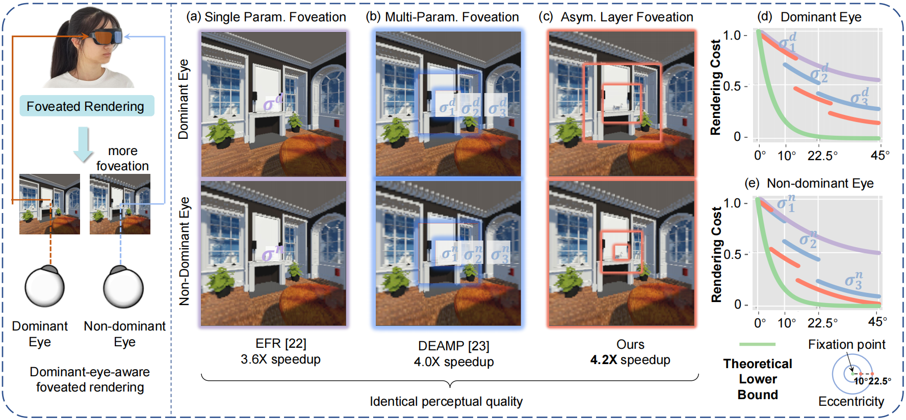
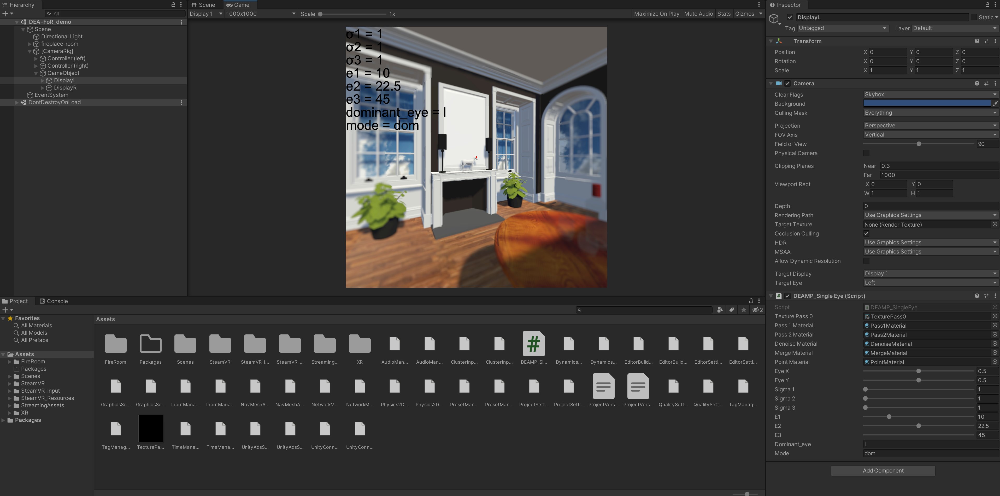
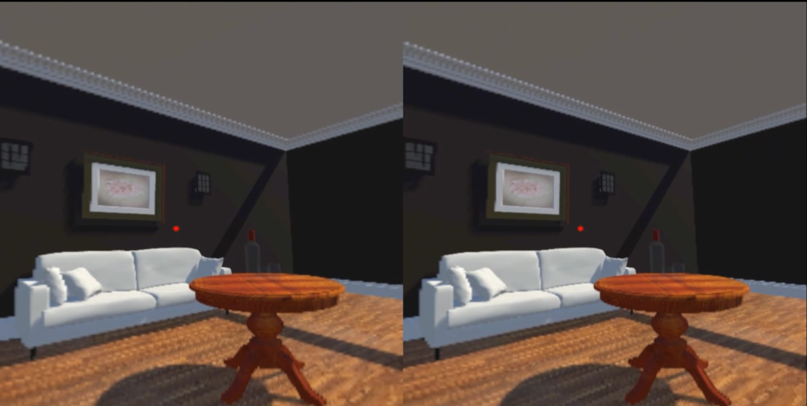

# Dominant-Eye-Aware Asymmetric Foveated Rendering for Virtual Reality

Paper: https://ieeexplore.ieee.org/abstract/document/11106279

Unity Demo Code of DEA-FoR (TVCG 2025). Tested on Unity 2020.3.8f1 and SteamVR v2.7.3.

## Abstract

To address the increasing computational demands of high-resolution virtual reality headsets, foveated rendering reduces pixel sampling in the peripheral regions of the visual field. However, existing methods have not fully leveraged binocular vision, particularly the dominant eye theory.
In our prior work, we proposed Dominant-Eye-Aware foveated rendering optimized with Multi-Parameter foveation (DEAMP), which divided each eye’s visual field into fixed eccentricity layers ([0, 10]°, [10, 22.5]°, [22.5, 45]°). The non-dominant eye received greater foveation within the same layers compared to the dominant eye. We further argue that the eccentricity ranges should vary between the eyes due to inter-eye, individual, and scene-specific differences. In this article, we introduce an enhanced method, Dominant-Eye-aware Asymmetric Foveated Rendering (DEA-FoR).
This treats eccentricity as a new variable, allowing users to select eccentricity sets tailored to their eyes and supporting asymmetric configurations between the two eyes. Experimental results demonstrate significant improvements in rendering speed over our previous method while maintaining perceptual quality. Additionally, we found that individual differences and scene texture complexity significantly influence the eccentricity settings.
This work offers new insights into perceptual differences in binocular vision and contributes to optimizing virtual reality experiences.

## Demonstration

**The Unity interface:** 

**Binocular display effect:** 

## Install

* Clone this repo and open the project with Unity 2020.3.8f1.

* Import SteamVR Unity Plugin from the unity asset store. (If needed)

(Or get access from github: [Release SteamVR Unity Plugin v2.7.3 (sdk 1.14.15) · ValveSoftware/steamvr_unity_plugin (github.com)](https://github.com/ValveSoftware/steamvr_unity_plugin/releases/tag/2.7.3))

## Usage

This is a demo for binocular vision, please use with a VR headset. 

You may control the parameters by keyboard keys:

#### Mode Control

* **O**: Show red lines indicating the layer boundaries.
* **LeftArrow, RightArrow, DownArrow, UpArrow**: Control the position of the fixate point.

* **D:** Set the dominant eye, 'l' for left and 'r' for right.
* **X:** Switch mode. There are 2 modes:
  * **"dom"**: Level of foveation increases in all 2 eyes, the goal is to determine the parameters of the dominant eye.
  * **"nondom"**: Level of foveation increases only in the non-dominant eye, the goal is to determine the parameters of the non-dominant eye after determining the parameters of the dominant eye.

#### Eccentricity

Adjust $e_1,e_2$ in the inspector window, $e_3$ is fixed to 45.0 degrees.

#### Level of foveation

* **F**: Increase the level of foveation of the all 3 layers (fovea, mid-periphery, periphery).
* **M**: Increase the level of foveation of the outer 2 layers (mid-periphery, periphery).
* **P**: Increase the level of foveation of the periphery layer.

Or use the *inspector* window of *DisplayL* and *DisplayR* for finer adjustments.

You can also adjust the angle range of the 3 layers using the *inspector* window of *DisplayL* and *DisplayR*.

